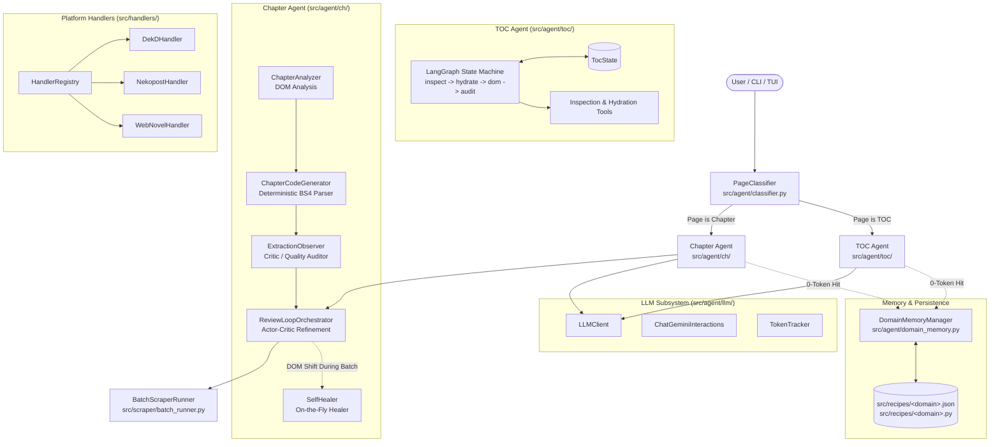
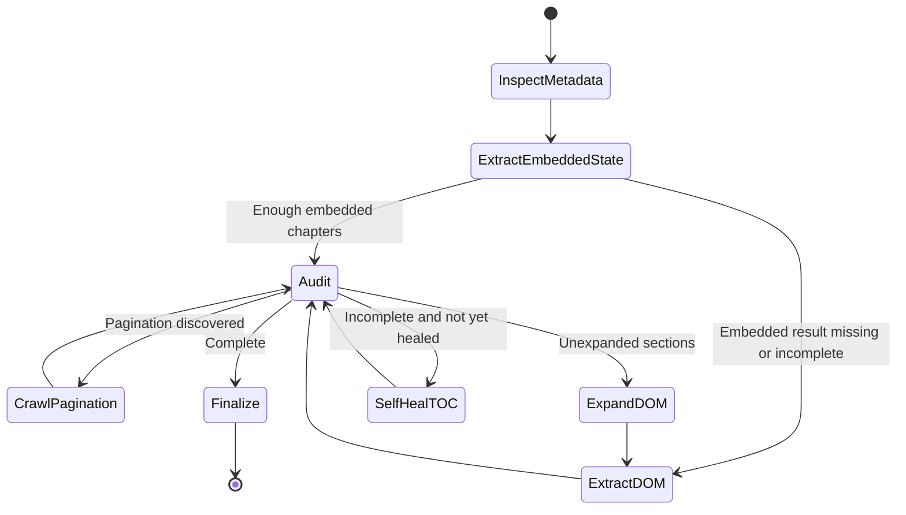
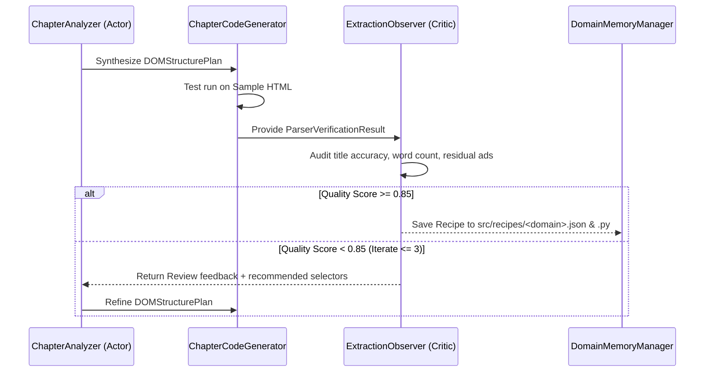

# AGENTS.md — Autonomous Agent Architecture Specification

> **Novel Scraping Agent** operates on an autonomous **Analyze-Once, Synthesize Deterministically, Self-Heal on Failure** paradigm.
> This document details the architectural boundaries, state graphs, execution models, and interfaces for all autonomous agents in the repository.

---

## 1. High-Level Architecture Overview

The system divides scraping intelligence into two primary autonomous agents coordinated by a front-line classification router and backed by persistent domain memory:



---

## 2. Agent Subsystems & File Layout

```
src/
├── agent/                         # Agent subsystem root
│   ├── __init__.py                # Package exports & unified entrypoints
│   ├── classifier.py              # Front-line URL & page classifier (TOC vs Chapter)
│   ├── domain_memory.py           # Domain memory manager & recipe cache (0-token fast path)
│   │
│   ├── toc/                       # Table of Contents (TOC) Agent
│   │   ├── __init__.py
│   │   ├── agent.py               # TocAgent entrypoint & coordinator
│   │   ├── graph.py               # LangGraph StateGraph definition
│   │   ├── state.py               # TocState TypedDict state schema
│   │   └── tools.py               # DOM link discovery & state hydration tools
│   │
│   ├── ch/                        # Chapter Extraction Agent
│   │   ├── __init__.py
│   │   ├── analyzer.py            # ChapterAnalyzer & DOMStructurePlan
│   │   ├── code_generator.py      # ChapterCodeGenerator & ExtractedChapter
│   │   ├── observer.py            # ExtractionObserver & ExtractionReview (Critic)
│   │   ├── review_loop.py         # ReviewLoopOrchestrator (Actor-Critic loop)
│   │   └── self_healer.py         # SelfHealer runtime repair
│   │
│   ├── llm/                       # LLM Foundation Subsystem
│   │   ├── __init__.py
│   │   ├── client.py              # LLMClient & ChatGeminiInteractions
│   │   ├── interactions.py        # Gemini Interactions API chaining
│   │   └── tracker.py             # Thread-safe TokenTracker & TokenCallbackHandler
│   │
│   └── (analyzer.py, etc.)        # Backward-compatibility shims
│
├── handlers/                      # Platform-specific bypasses & scrapers
│   ├── __init__.py                # Handler registry & singleton instance
│   ├── base.py                    # BasePlatformHandler abstract base class
│   ├── registry.py                # HandlerRegistry URL router
│   ├── dekd.py                    # Dek-D REST API & synthetic HTML
│   ├── nekopost.py                # Nekopost decryption & JSON API
│   └── webnovel.py                # WebNovel catalog & metadata
│
└── core/                          # Browser engine & low-level infrastructure
    ├── binary_manager.py          # Obscura binary download & verification
    └── obscura_client.py          # Playwright CDP client & network session
```

---

## 3. Agent 1: Table of Contents (TOC) Agent (`src/agent/toc/`)

### Role & Purpose
The **TOC Agent** is a LangGraph state machine for extracting and auditing chapter links from novel landing pages. It can resolve pagination, embedded application state, JSON-LD, and interactive or incomplete DOM listings; completeness depends on the signals available from the target site.

### Key Components
- **[`TocAgent`](file:///D:/Code/Novel_scraping_agent/src/agent/toc/agent.py)**: Public API facade that wraps the LangGraph workflow.
- **[`graph.py`](file:///D:/Code/Novel_scraping_agent/src/agent/toc/graph.py)**: Compiles and runs the LangGraph `StateGraph`.
- **[`state.py`](src/agent/toc/state.py)**: `TocState` TypedDict definition. Key fields include `url`, `html`, `novel_title`, `author`, `description`, `claimed_chapter_count`, `extracted_chapters`, `extraction_strategy`, `confidence_score`, `has_unexpanded_sections`, `has_pagination`, `pagination_urls`, `is_complete`, `heal_attempted`, custom selectors, iteration limits, issues, and logs.
- **[`tools.py`](src/agent/toc/tools.py)**: Implements `ClaimInspector`, `EmbeddedStateExtractor`, `DomLinkExtractor`, `InteractiveDomExpander`, `PaginatedTocCrawler`, `TocAuditor`, and `TocSynthesizer`.

### State Transition Workflow



---

## 4. Agent 2: Chapter Extraction Agent (`src/agent/ch/`)

### Role & Purpose
The **Chapter Agent** inspects chapter pages, performs semantic DOM structure analysis, synthesizes deterministic BeautifulSoup Python scrapers, and executes an Actor-Critic Observer review loop to guarantee clean story text without navigation clutter, watermarks, or ads.

### Key Components
- **[`ChapterAnalyzer`](file:///D:/Code/Novel_scraping_agent/src/agent/ch/analyzer.py)** *(Generator / Actor)*:
  - Builds an abstracted DOM skeleton.
  - Uses Google Gemini Interactions API with schema enforcement to output a [`DOMStructurePlan`](file:///D:/Code/Novel_scraping_agent/src/agent/ch/analyzer.py) (`title_selector`, `content_selector`, `remove_selectors`, `clean_paragraphs`).
  - Supports deterministic fallback heuristics when LLM is unavailable.
- **[`ChapterCodeGenerator`](file:///D:/Code/Novel_scraping_agent/src/agent/ch/code_generator.py)** *(Synthesizer)*:
  - Translates the `DOMStructurePlan` into executable Python code.
  - Validates extraction against live sample HTML in a sandboxed execution context.
  - Extracts clean Markdown, word count, character count, and paywall flags.
- **[`ExtractionObserver`](file:///D:/Code/Novel_scraping_agent/src/agent/ch/observer.py)** *(Critic / Auditor)*:
  - Audits the sample output against quality thresholds.
  - Returns structured [`ExtractionReview`](file:///D:/Code/Novel_scraping_agent/src/agent/ch/observer.py) (`quality_score`, `is_accurate`, `title_accurate`, `has_clutter`, `issues`, `recommended_fixes`).
- **[`ReviewLoopOrchestrator`](src/agent/ch/review_loop.py)**:
  - Checks a saved chapter recipe before starting analysis; otherwise iteratively pairs `ChapterAnalyzer` with `ExtractionObserver` up to `MAX_REVIEW_ITERATIONS` (default: 32 in `src/config.py`).
  - Feeds observer critique back to the analyzer and uses `previous_interaction_id` to preserve multi-turn reasoning context. Approval requires an accurate review meeting `MIN_QUALITY_SCORE` (default: 0.85).
- **[`SelfHealer`](file:///D:/Code/Novel_scraping_agent/src/agent/ch/self_healer.py)**:
  - Activated during batch scraping if a site alters DOM structure mid-novel (e.g. volume separator shifts).
  - Automatically re-analyzes, patches selectors, verifies the recovery, and resumes batch execution.

### Actor-Critic Review Loop



---

## 5. Domain Memory & 0-Token Fast Path (`src/agent/domain_memory.py`)

To eliminate redundant LLM calls and minimize latency/costs:
1. When **TOC Agent** or **Chapter Agent** completes a verified extraction, [`DomainMemoryManager`](file:///D:/Code/Novel_scraping_agent/src/agent/domain_memory.py) persists:
   - `src/recipes/<domain>.json`: Serialized selectors and configuration.
   - `src/recipes/<domain>.py`: Generated Python extractor script containing the recipe's TOC and chapter extraction logic (uses the project's parsing dependencies).
2. On subsequent scrape requests for the same domain:
   - The agent checks domain memory.
   - If a recipe is cached and validates against the current HTML, the matching extraction/classification step can run without another LLM call.
   - A recipe that fails validation falls back to the normal classification or analysis path.

---

## 6. LLM Subsystem (`src/agent/llm/`)

- **[`LLMClient`](file:///D:/Code/Novel_scraping_agent/src/agent/llm/client.py)**: Main entrypoint for LLM operations.
- **[`ChatGeminiInteractions`](file:///D:/Code/Novel_scraping_agent/src/agent/llm/client.py)**: Custom LangChain `BaseChatModel` implementation for Google Gemini's Interactions API. Supports:
  - Multi-turn state chaining via `previous_interaction_id`.
  - Structured schema decoding via Pydantic.
  - Native thought-token and prompt-token separation.
- **[`TokenTracker`](file:///D:/Code/Novel_scraping_agent/src/agent/llm/tracker.py)**: Thread-safe singleton for real-time token metrics and cost accounting across all agents.

---

## 7. Platform Handlers (`src/handlers/`)

When websites employ non-DOM architectures (such as proprietary client-side encryption or private REST APIs), requests are handled by dedicated platform handlers before hitting Obscura:
- **`BasePlatformHandler`** ([`src/handlers/base.py`](file:///D:/Code/Novel_scraping_agent/src/handlers/base.py)): Interface contract (`matches(url)` and `handle(url, obscura_client)`).
- **`HandlerRegistry`** ([`src/handlers/registry.py`](file:///D:/Code/Novel_scraping_agent/src/handlers/registry.py)): Global registry for platform dispatch.
- **`DekDHandler`** ([`src/handlers/dekd.py`](file:///D:/Code/Novel_scraping_agent/src/handlers/dekd.py)): Dek-D public REST API ingestion & synthetic HTML generator.
- **`NekopostHandler`** ([`src/handlers/nekopost.py`](file:///D:/Code/Novel_scraping_agent/src/handlers/nekopost.py)): Nekopost AES decryption & detail2 API resolver.
- **`WebNovelHandler`** ([`src/handlers/webnovel.py`](file:///D:/Code/Novel_scraping_agent/src/handlers/webnovel.py)): WebNovel book catalog & metadata scraper.

---

## 8. Guidelines for Adding or Modifying Agents

1. **Keep Agents Focused**:
   - Navigation and chapter enumeration belong in `src/agent/toc/`.
   - Content extraction, selector refinement, and quality scoring belong in `src/agent/ch/`.
   - LLM wrappers and metrics belong in `src/agent/llm/`.
   - Site-specific API/decryption bypasses belong in `src/handlers/`.
2. **Preserve Backward Compatibility**:
   - If an agent class or function is moved, maintain a re-export shim in `src/agent/` to avoid breaking downstream callers or legacy scripts.
3. **Verify with Tests**:
   - All changes must pass the full test suite (`uv run pytest`).
   - Mock network calls and LLM outputs in unit tests to ensure deterministic CI runs.
