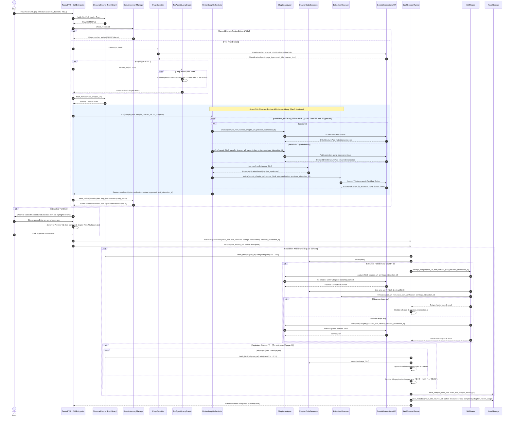
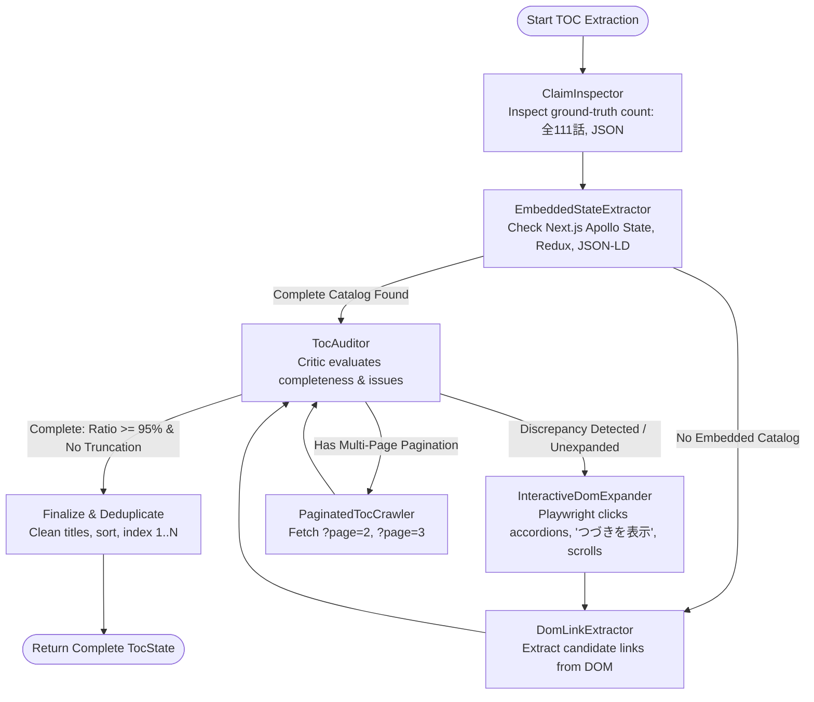

# Agent Workflow & Architecture Guide

This document provides a comprehensive technical breakdown of the autonomous web novel scraping system. It details the architecture and operational flow across the **Obscura anti-detect headless browser**, the **Domain Memory & Recipe Engine**, the **Google Gemini Interactions API & LangChain**, the **Autonomous TocAgent with LangGraph**, the **deterministic parser synthesizer**, the **Actor-Critic Quality Control Observer loop**, the **state-chained self-healing engine**, the **paginated multi-page chapter stitcher**, the **specialized platform handlers (Dek-D, Nekopost, Kakuyomu, Syosetu)**, the **universal multi-language romanization engine**, the **persistent file logger**, the **storage manager**, and the **Textual / Rich TUI**.

---

## 1. High-Level System Architecture

The agent follows an **Analyze-Once, Synthesize Deterministically, Self-Heal on Failure** pattern with a **Domain Memory 0-Token Fast-Path**:
1. When a novel URL is provided, the agent checks if a validated recipe exists in `recipes/<domain>.json`. If so, it bypasses LLM analysis entirely and extracts both TOC and chapters in milliseconds.
2. If no recipe exists, the agent invokes Gemini to classify the URL and runs the autonomous **TocAgent** (powered by a LangGraph cyclic StateGraph) to audit and extract the complete chapter catalog.
3. It executes an Actor-Critic Observer review loop on a sample chapter, synthesizes a high-speed Python/BeautifulSoup extractor, saves the domain recipe for future visits, and runs polite concurrent batch downloads.

```mermaid
flowchart TD
    subgraph Ingestion ["1. Ingestion"]
        URL["Target URL (TOC or Single Chapter)"]
    end

    subgraph Core ["2. Obscura & Platform Handlers"]
        Bin["Binary Manager (ensure_obscura)"] --> Client["ObscuraClient (CLI Fast Dump / CDP)"]
        DekD["Dek-D Handler (API & Synthetic HTML)"] -.-> Client
        Neko["Nekopost Handler (JSON Decoders)"] -.-> Client
        URL --> Client
    end

    subgraph Memory ["3. Domain Memory Fast-Path (0-Token)"]
        Client --> RecipeCheck{"Domain Recipe Exists in recipes/?"}
        RecipeCheck -->|Yes: Valid Recipe| FastPath["DomainMemoryManager Fast-Path\n(Bypass LLM: 0 Tokens)"]
    end

    subgraph Intelligence ["4. Agent Intelligence (LangChain & LangGraph)"]
        RecipeCheck -->|No / Invalid| Classifier["PageClassifier (Smart Link Prioritization)"]
        Classifier -->|If Chapter URL| TOCFinder["TOC Discovery (Auto-Nav)"]
        TOCFinder --> Classifier
        Classifier --> TocAgent["TocAgent (LangGraph Cyclic State Machine)"]
        TocAgent --> Analyzer["ChapterAnalyzer (DOM Skeleton Synthesis)"]
        Analyzer --> Gemini["Gemini Interactions API (client.interactions.create)"]
        Gemini --> Token["TokenTracker (Prompt, Completion, Thought Tokens)"]
        Gemini --> Plan["DOMStructurePlan (Title, Content, Clutter Selectors)"]
    end

    subgraph ReviewLoop ["5. Actor-Critic Observer Review Loop"]
        Plan --> Orchestrator["ReviewLoopOrchestrator"]
        Orchestrator --> CodeGen["ChapterCodeGenerator"]
        CodeGen --> Verify["Verification Engine (test_and_verify)"]
        Verify --> Observer["ExtractionObserver (Title, Clutter, Completeness Audit)"]
        Observer -->|is_accurate=False / Score < 0.85| Refine["ChapterAnalyzer.refine (Chained Interaction)"]
        Refine --> CodeGen
        Observer -->|is_accurate=True / Score >= 0.85| ApprovedPlan["ReviewLoopResult (Verified Plan + last_interaction_id)"]
        ApprovedPlan --> SaveRecipe["DomainMemoryManager.save_recipe()\nrecipes/<domain>.json & .py"]
    end

    subgraph Execution ["6. Polite Batch Scraper"]
        ApprovedPlan -->|User Approval Gate| Batch["BatchScraperRunner (Async Worker Queue)"]
        FastPath --> Batch
        Batch --> ObscuraFetch["Obscura fetch_html() with Jitter Delay (0.5s-1.5s)"]
        ObscuraFetch --> Extractor["Execute Synthesized Parser"]
        Extractor -->|Failure / Short Text (<50 chars)| Healer["SelfHealer (Observer-Audited Recovery)"]
        Healer -->|previous_interaction_id| Gemini
        Extractor --> SubpageCheck{"Multi-Page Chapter?\n(下一页 / next page / ?page=N)"}
        SubpageCheck -->|Yes| Stitcher["Subpage Stitcher (_stitch_subpages)\nConcatenate Markdown & Strip (1/3)"]
        SubpageCheck -->|No| Formatter["Sanitize Title & Format Markdown"]
        Stitcher --> Formatter
    end

    subgraph Storage ["7. Storage, Romanization & Logs"]
        Formatter --> Romanizer["Universal Romanizer (pykakasi + anyascii)"]
        Romanizer --> Folder["Romanized Folder: novels/<Romanized_Title>/"]
        Folder --> MD["Clean Raw Markdown: <0001> - <Title>.md\n(Optional YAML Frontmatter)"]
        Folder --> Meta["metadata.json (Author, Chapters, Token Usage)"]
        Batch --> LogFile["File Logger: logs/tui_*.log & logs/scraper_*.log"]
    end

    subgraph UI ["8. User Interfaces"]
        TUI["Textual Interactive TUI\n- Table of Contents with Row Selection\n- Scrollable Markdown Reader Preview\n- Standalone Monokai Code View\n- Live Logs"]
        CLI["Headless CLI Runner (--auto --concurrency N)"]
    end
```

---

## 2. End-to-End Sequence of Operations



---

## 3. Detailed Component Breakdown

### A. Obscura Headless Browser Engine (`src/core/`)

[`src/core/binary_manager.py`](file:///D:/Code/Novel_scraping_agent/src/core/binary_manager.py) and [`src/core/obscura_client.py`](file:///D:/Code/Novel_scraping_agent/src/core/obscura_client.py) manage the low-level browser automation layer:

1. **Automatic Binary Download & Verification**: Checks local `./bin/obscura.exe`. If absent, automatically fetches the latest stealth release from GitHub releases (`h4ckf0r0day/obscura`).
2. **Playwright CDP Daemon**: Launches an anti-detect Obscura CDP server daemon on port 9222 with `--stealth --allow-private-network`.
3. **Fingerprint Masquerading**: Emulates genuine browser headers, TLS handshakes, Canvas/WebGL fingerprints, and resolves Cloudflare Turnstile / Akamai challenges transparently.

---

### B. Specialized Platform Handlers (`src/core/`)

1. **Dek-D Platform Handler ([`src/core/dekd_handler.py`](file:///D:/Code/Novel_scraping_agent/src/core/dekd_handler.py))**:
   - Parses URLs across both `writer.dek-d.com` and `novel.dek-d.com`.
   - Bypasses complex JavaScript obfuscation by directly fetching official chapter listings and novel details via Dek-D's JSON endpoints (`/api/view/v1/novel/detail`, `/api/view/v1/novel/chapters`).
   - Automatically constructs synthetic HTML documents containing author metadata, chapter counts, and embedded JSON schemas (`__DEKD_DATA__`) for instant zero-loss TocAgent extraction.
2. **Nekopost Platform Handler ([`src/core/nekopost_handler.py`](file:///D:/Code/Novel_scraping_agent/src/core/nekopost_handler.py))**:
   - Handles project URLs (`/novel/<id>`).
   - Queries Nekopost project detail endpoints (`/api/project/detail2`) to decode JSON chapter indices, episode numbers, and publish dates without loading bulky client-side SPAs.

---

### C. Domain Memory & Recipe Engine (`src/agent/domain_memory.py`)

1. **Persistent Recipe Store (`recipes/`)**:
   - Upon successful verification of an extraction plan by the Observer review loop, [`DomainMemoryManager`](file:///D:/Code/Novel_scraping_agent/src/agent/domain_memory.py) saves a domain recipe as `recipes/<domain>.json`.
   - Stores:
     - `domain`: Registered domain name (e.g. `kakuyomu.jp`, `writer.dek-d.com`).
     - `toc_strategy`: Discovered strategy (`embedded_state`, `dom_heuristic`, `paginated_dom`).
     - `chapter_plan`: CSS selectors for title, content, and removal targets.
     - `quality_score`: Observer score (e.g. `1.0`).
     - `sample_chapter_url` & `sample_toc_url`.
2. **Standalone Python Extractor Generation (`recipes/<domain>.py`)**:
   - Automatically generates a complete, self-contained, deterministic Python scraper file ready for external scripts, testing, or standalone execution.
3. **0-Token Fast-Path Execution**:
   - Prior to making any LLM classification call, the agent tests the candidate page against the cached recipe.
   - If verified, the pipeline transitions directly to batch downloading without consuming tokens.

---

### D. Autonomous Table of Contents (TOC) Agent with LangGraph (`src/agent/toc/`)

Modern novel platforms frequently obscure their chapter catalogs using accordion tabs (`1〜30`, `31〜60`), "Show More" buttons (`つづきを表示`), client-side Next.js Apollo caches, or multi-page indexes. [`TocAgent`](file:///D:/Code/Novel_scraping_agent/src/agent/toc/agent.py) operates a **LangGraph cyclic StateGraph**:



1. **`ClaimInspector`**: Discovers the claimed chapter count from embedded JSON schemas or badges (`全111話`), establishing the ground-truth baseline.
2. **`EmbeddedStateExtractor`**: Instantly resolves the complete chapter list directly from SSR hydration payloads (`__APOLLO_STATE__`, `TableOfContentsChapter`, `__DEKD_DATA__`), bypassing DOM truncation in 0.01 seconds.
3. **`DomLinkExtractor`**: Semantic heuristic parser that detects chapter links via platform-specific CSS classes (`WorkTocSection_link`) and URL/title heuristics (`/episodes/`, `第.*話`).
4. **`TocAuditor`**: The critic node that computes completeness ratio (`extracted / claimed`) and identifies truncation issues or unexpanded sections.

---

### E. Actor-Critic Quality Control Observer Review Loop (`src/agent/observer.py`, `src/agent/review_loop.py`)

To eliminate inaccurate chapter titles and unwanted clutter (navigation buttons, ads, cheer widgets, author notes), the agent implements an **Actor-Critic Review Loop**:
1. **ExtractionObserver ([`src/agent/observer.py`](file:///D:/Code/Novel_scraping_agent/src/agent/observer.py))**: Dedicated critic agent inspecting the extracted sample preview across Title Accuracy, Clutter Detection, and Completeness. Emits an `ExtractionReview` with a numerical `quality_score` (0.0 - 1.0).
2. **ReviewLoopOrchestrator ([`src/agent/review_loop.py`](file:///D:/Code/Novel_scraping_agent/src/agent/review_loop.py))**: Coordinates iterative refinement between generator and critic up to 3 turns, preserving conversational reasoning state using Gemini's `previous_interaction_id`.

---

### F. Interactive User Interface & Textual TUI (`src/ui/app.py`, `src/ui/widgets/reader.py`)

1. **Interactive Table of Contents (`tab-toc`)**:
   - Interactive Textual `DataTable` with row selection (`on_data_table_row_selected`).
   - Clicking or pressing `Enter` on any chapter instantly switches to `tab-preview`. If it is the sample chapter, it renders immediately; if another chapter, it dynamically fetches and parses it in the background!
2. **Focusable Scrollable Reader (`tab-preview`)**:
   - Powered by [`RichMarkdownReader`](file:///D:/Code/Novel_scraping_agent/src/ui/widgets/reader.py), which inherits from `VerticalScroll` with `can_focus = True` for smooth keyboard arrow, PageUp/PageDown, and mouse-wheel scrolling.
   - Dynamic `#chapter-preview-header` shows the active chapter title.
3. **Parser Code View (`tab-code`)**:
   - Monokai syntax-highlighted display of the synthesized BeautifulSoup Python script.
4. **Automatic Tab Navigation**:
   - Switches to `tab-logs` during analysis so users can watch Obscura and LLM reasoning live.
   - Switches to `tab-toc` or `tab-preview` upon analysis completion.
5. **Persistent Session File Logging (`src/utils/logger.py`)**:
   - Logs clean, ANSI-stripped output into `logs/tui_<timestamp>.log` and symlinked `logs/tui_latest.log`.

---

## 4. Testing & Verification

The project is backed by **92 automated unit, integration, and E2E tests** across 16 test modules:
```powershell
pytest tests/
```
All tests verify zero-regression guarantees across Obscura network hooks, LangGraph state transitions, DOM selector synthesis, and TUI interactivity.
