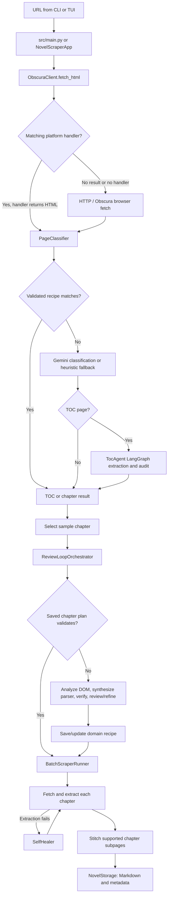

# Agent Workflow

This guide follows a scrape from URL input through extraction and persistence. For the complete package map and module responsibilities, see [Architecture and Project Structure](agent_architecture.md).

## End-to-end flow

The CLI's `--auto` mode runs the pipeline without the TUI. The interactive interface uses the same extraction and storage components while providing logs, chapter previews, and progress controls.

## Workflow stages

### 1. Fetch the page

`src/core/obscura_client.py` exposes `ObscuraClient.fetch_html()`. It checks the registry in `src/handlers/` first. A matching handler can return platform-provided or synthesized HTML; if the handler has no result or fails, the client continues through its regular HTTP and browser retrieval paths.

### 2. Classify and resolve a TOC

`src/agent/classifier.py` uses `PageClassifier` to return a `ClassificationResult` containing page type, novel metadata, and chapter links. It first attempts to validate a saved domain recipe. Otherwise, it uses Gemini when configured, with a deterministic heuristic fallback.

For a TOC page, the classifier delegates to `src/agent/toc/agent.py`. `TocAgent` runs the workflow compiled by `TocGraphWorkflow` in `src/agent/toc/graph.py`:

1. Inspect page metadata, embedded counts, and pagination links.
2. Extract a chapter list from embedded state when available.
3. Use DOM extraction when embedded state is missing or incomplete.
4. Audit chapter count and page signals.
5. Route incomplete results to pagination crawling, interactive DOM expansion, or TOC selector synthesis.
6. De-duplicate, normalize order and titles, and re-index the final chapter list.

The workflow state is defined in `src/agent/toc/state.py`; extraction and audit helpers are in `src/agent/toc/tools.py`. When the input is a chapter page with a discoverable TOC URL, the entrypoint can extract that TOC before starting the batch.

### 3. Analyze and verify a sample chapter

The pipeline selects a chapter sample and invokes `ReviewLoopOrchestrator` from `src/agent/ch/review_loop.py`. The orchestrator checks a stored chapter recipe first. If it cannot validate the recipe, it coordinates:

- `ChapterAnalyzer` (`src/agent/ch/analyzer.py`) to propose a `DOMStructurePlan`;
- `ChapterCodeGenerator` (`src/agent/ch/code_generator.py`) to synthesize and test deterministic extraction code;
- `ExtractionObserver` (`src/agent/ch/observer.py`) to assess the sample and provide structured feedback.

The loop refines selectors until the review is approved or the configured iteration limit is reached. The best result is retained if the limit is reached without approval.

### 4. Save reusable domain knowledge

`src/agent/domain_memory.py` stores TOC and chapter extraction settings in `recipes/<domain>.json` and emits corresponding Python extractor code in `recipes/<domain>.py`. Recipes are validated against current HTML before use; a failed check falls back to normal classification or analysis rather than treating a stale recipe as authoritative.

### 5. Scrape and save chapters

`src/scraper/batch_runner.py` schedules chapter work with bounded concurrency and configured request delays. For each chapter it fetches HTML, runs the current parser, and invokes `SelfHealer` (`src/agent/ch/self_healer.py`) if extraction fails. It also follows supported next-page links inside a chapter and combines extracted content.

`NovelStorage` in `src/scraper/storage.py` writes sanitized chapter Markdown and updates `metadata.json`. Folder romanization, title cleanup, and persistent logging are provided by `src/utils/`.

## Entry points and local verification

- Install/run the CLI with `novel-scraper`; add `--auto --url <URL>` for headless operation and optionally `--concurrency <N>`.
- Run tests with `uv run pytest` from the repository root.
- See [README.md](../README.md) for setup, configuration, CLI examples, and output format.
