# 🏗️ Novel Scraping Agent — Architecture & Pipeline Documentation

> Comprehensive technical documentation of the autonomous TOC extraction and Chapter scraping pipeline.

---

## 1. High-Level System Overview

The Novel Scraping Agent is a multi-stage, LLM-powered pipeline that autonomously scrapes web novels from any website. It takes a single URL as input and outputs a complete, organized collection of chapter Markdown files.

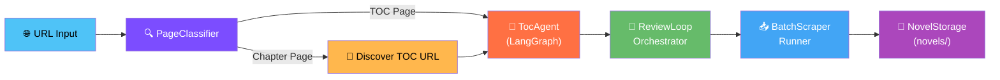

### Key Components at a Glance

| Stage | Component | File | Purpose |
|-------|-----------|------|---------|
| 1 | **PageClassifier** | [classifier.py](file:///D:/Code/Novel_scraping_agent/src/agent/classifier.py) | Classify URL as TOC or Chapter |
| 2 | **TocAgent** | [agent.py](file:///D:/Code/Novel_scraping_agent/src/agent/toc/agent.py) | Extract complete chapter list via LangGraph |
| 3 | **ReviewLoopOrchestrator** | [review_loop.py](file:///D:/Code/Novel_scraping_agent/src/agent/review_loop.py) | Iterative Generator ↔ Observer refinement |
| 4 | **BatchScraperRunner** | [batch_runner.py](file:///D:/Code/Novel_scraping_agent/src/scraper/batch_runner.py) | Concurrent chapter downloading |
| 5 | **NovelStorage** | [storage.py](file:///D:/Code/Novel_scraping_agent/src/scraper/storage.py) | File I/O, metadata.json persistence |
| ⚡ | **DomainMemoryManager** | [domain_memory.py](file:///D:/Code/Novel_scraping_agent/src/agent/domain_memory.py) | 0-token fast-path for known domains |
| 🌐 | **ObscuraClient** | [obscura_client.py](file:///D:/Code/Novel_scraping_agent/src/core/obscura_client.py) | HTTP + headless browser fetching |
| 🧠 | **LLMClient** | [llm_client.py](file:///D:/Code/Novel_scraping_agent/src/agent/llm_client.py) | Gemini LLM via LangChain LCEL |

---

## 2. The Full Pipeline — Step by Step

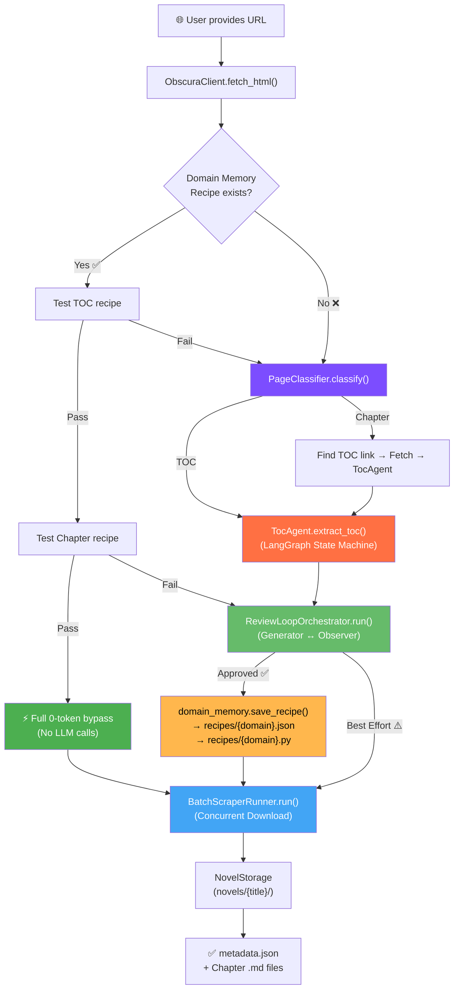

---

## 3. Stage 1 — Page Classification

**File:** [classifier.py](file:///D:/Code/Novel_scraping_agent/src/agent/classifier.py)
**Class:** `PageClassifier`

The classifier determines whether a given URL is a **Table of Contents (TOC)** page or a **single Chapter** page.

### Classification Flow

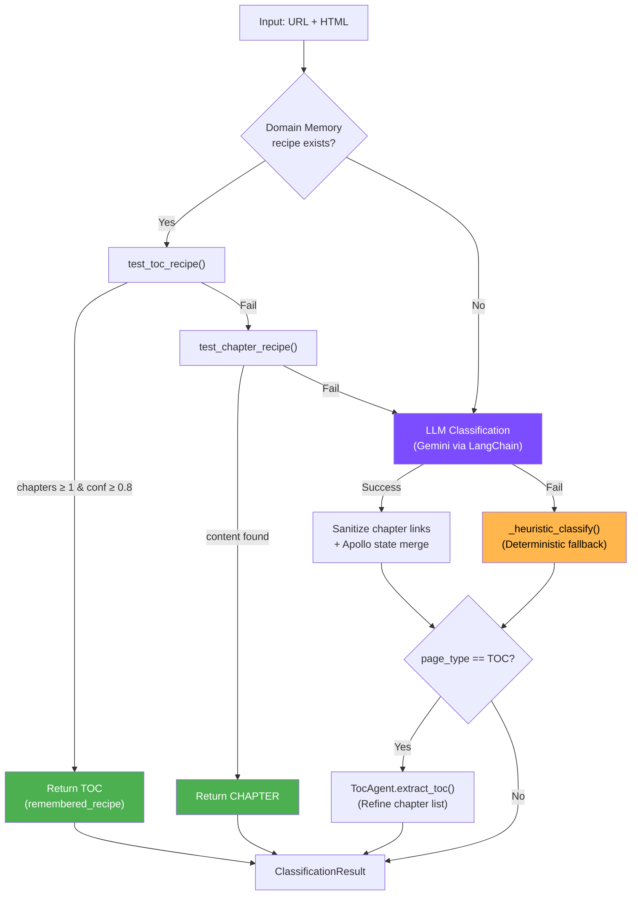

### Key Data Models

```python
class ClassificationResult(BaseModel):
    page_type: str       # "TOC" or "CHAPTER"
    novel_title: str
    author: Optional[str]
    description: Optional[str]
    chapter_links: List[ChapterLink]   # Populated if TOC
    toc_url: Optional[str]             # Discovered if CHAPTER
    toc_state: Optional[dict]          # Full TocAgent state if TOC

class ChapterLink(BaseModel):
    index: int       # 1-based sequential index
    title: str       # Clean chapter title
    url: str         # Absolute URL
```

### What happens internally

1. **Domain Memory Bypass** — Checks `DomainMemoryManager` for a saved recipe. If found, tests both TOC and chapter extraction. On success, returns immediately with **zero LLM tokens**.
2. **LLM Path** — Sends a condensed page summary (title, H1s, sample links) to Gemini. The LLM returns structured JSON matching `ClassificationResult`.
3. **Apollo/Next.js Merge** — If `__NEXT_DATA__` script is present (e.g., Kakuyomu), extracts episode list from Apollo state and merges it.
4. **Heuristic Fallback** — If LLM is unavailable, uses regex pattern matching on link text/URLs to detect chapter links (≥4 links = TOC).
5. **TocAgent Refinement** — If classified as TOC, delegates to `TocAgent` for a more thorough extraction.

---

## 4. Stage 2 — TOC Extraction (LangGraph State Machine)

**Files:**
- [agent.py](file:///D:/Code/Novel_scraping_agent/src/agent/toc/agent.py) — `TocAgent` wrapper
- [graph.py](file:///D:/Code/Novel_scraping_agent/src/agent/toc/graph.py) — `TocGraphWorkflow` (LangGraph `StateGraph`)
- [state.py](file:///D:/Code/Novel_scraping_agent/src/agent/toc/state.py) — `TocState` TypedDict
- [tools.py](file:///D:/Code/Novel_scraping_agent/src/agent/toc/tools.py) — Extraction tools

### LangGraph State Machine Architecture

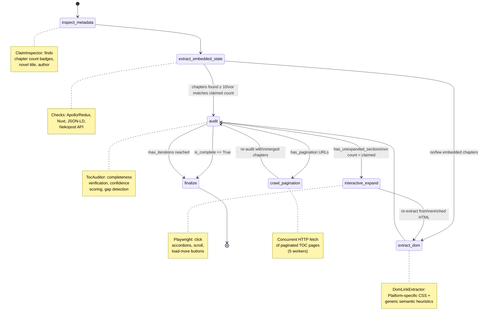

### TocState — The Graph State

```python
class TocState(TypedDict):
    url: str                           # Source TOC URL
    html: str                          # Current HTML (updated after expand/pagination)
    novel_title: str                   # Extracted novel name
    author: Optional[str]
    description: Optional[str]
    claimed_chapter_count: Optional[int]  # From badges like "全111話"
    extracted_chapters: List[ChapterLink] # Current chapter list
    extraction_strategy: str           # "embedded_state" | "dom_heuristic" | "paginated_dom"
    confidence_score: float            # 0.0 → 1.0
    has_unexpanded_sections: bool      # Collapsed accordions detected
    has_pagination: bool               # Multi-page TOC detected
    pagination_urls: List[str]         # URLs of subsequent TOC pages
    is_complete: bool                  # Auditor verdict
    iteration: int                     # Current audit loop iteration
    max_iterations: int                # Safety cap (default: 3)
    issues: List[str]                  # Auditor-reported issues
    logs: List[str]                    # Execution trace
```

### Node Details

#### 1. `inspect_metadata` — ClaimInspector
Scans HTML for chapter count badges (e.g., `"全111話"`, `"111 chapters"`), novel title from `<h1>`/meta tags, author, and description. Also detects pagination URLs.

#### 2. `extract_embedded_state` — EmbeddedStateExtractor
Extracts chapter lists from JavaScript framework state:
- **Next.js / Apollo** — `__NEXT_DATA__` script tag → `__APOLLO_STATE__` → episode unions
- **Nuxt.js** — `__NUXT_DATA__` or `window.__NUXT__`
- **JSON-LD** — `<script type="application/ld+json">`
- **Nekopost** — Custom API endpoint

#### 3. `extract_dom` — DomLinkExtractor
Extracts chapter links from the DOM using a two-tier approach:
1. **Platform-specific CSS selectors** — Kakuyomu (`a.widget-toc-episode-episodeTitle`), Syosetu (`dl.novel_sublist2 a`), etc.
2. **Generic semantic heuristic** — Finds all `<a>` tags, filters by chapter URL/text patterns, removes action buttons, sorts numerically.

#### 4. `audit` — TocAuditor (The Critic)
Evaluates extraction completeness:
- Compares `len(chapters)` vs `claimed_count`
- Detects unexpanded accordion sections
- Checks for pagination indicators
- Outputs `confidence_score` (0.0–1.0)

#### 5. `interactive_expand` — InteractiveDomExpander
Uses Playwright via Obscura to interact with the page:
- Clicks accordion toggles, "Show more" / "Load more" buttons
- Scrolls to bottom for infinite scroll
- Returns enriched HTML for re-extraction

#### 6. `crawl_pagination` — PaginatedTocCrawler
Concurrently fetches subsequent TOC pages (5 workers):
- Fast HTTP first, Obscura browser fallback
- Extracts chapters from each page via `DomLinkExtractor`
- Deduplicates, re-indexes, and handles reverse chronological ordering

#### 7. `finalize`
Deduplicates by URL, re-indexes chapters 1..N, outputs final clean list.

### Conditional Routing Logic

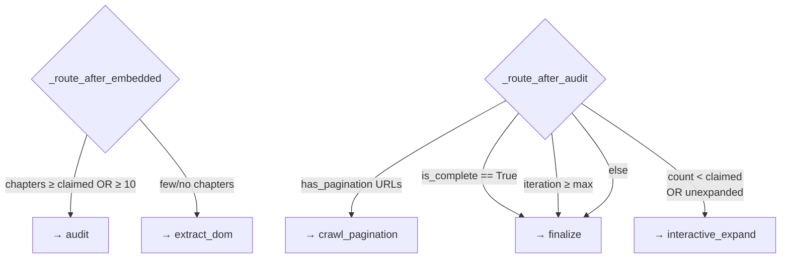

---

## 5. Stage 3 — Review Loop (Generator ↔ Observer Pattern)

**File:** [review_loop.py](file:///D:/Code/Novel_scraping_agent/src/agent/review_loop.py)
**Class:** `ReviewLoopOrchestrator`

This stage determines **how** to extract chapter content (title, body text) from a single chapter page. It uses an iterative refinement loop between a **Generator** (ChapterAnalyzer) and an **Observer** (ExtractionObserver).

### Review Loop Architecture

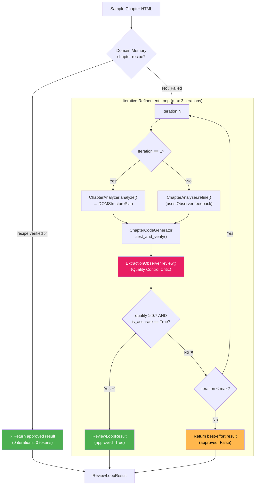

### Sub-Components

#### ChapterAnalyzer ([analyzer.py](file:///D:/Code/Novel_scraping_agent/src/agent/analyzer.py))

| Method | Purpose |
|--------|---------|
| `analyze(html, url)` | First pass: sends DOM skeleton to LLM → returns `DOMStructurePlan` |
| `refine(html, url, plan, review)` | Subsequent passes: sends Observer feedback → returns improved plan |
| `_heuristic_analyze(html)` | LLM-free fallback using common CSS selectors |
| `_prepare_dom_skeleton(html)` | Creates compact representation with title candidates + large text containers |

```python
class DOMStructurePlan(BaseModel):
    title_selector: str          # CSS selector for chapter title heading
    content_selector: str        # CSS selector for main novel body container
    remove_selectors: List[str]  # CSS selectors for clutter (ads, nav, scripts)
    clean_paragraphs: bool       # Whether to normalize paragraphs
```

#### ChapterCodeGenerator ([code_generator.py](file:///D:/Code/Novel_scraping_agent/src/agent/code_generator.py))

| Method | Purpose |
|--------|---------|
| `generate_code_string()` | Generates standalone Python `extract_chapter(html)` function |
| `extract(html)` | Runs extraction directly → returns `ExtractedChapter` |
| `test_and_verify(html)` | Extracts + generates preview → returns `ParserVerificationResult` |

#### ExtractionObserver ([observer.py](file:///D:/Code/Novel_scraping_agent/src/agent/observer.py))

The "critic" agent that reviews extracted content quality:

| Check | What It Looks For |
|-------|-------------------|
| **Title Check** | Is the title the real chapter title, or a generic label? |
| **Clutter Check** | Did nav buttons, social widgets, or copyright leak into text? |
| **Completeness** | Does the story start and end coherently? |
| **Scoring** | Rates `quality_score` (0.0–1.0), sets `is_accurate` flag |

---

## 6. Stage 4 — Batch Downloading

**File:** [batch_runner.py](file:///D:/Code/Novel_scraping_agent/src/scraper/batch_runner.py)
**Class:** `BatchScraperRunner`

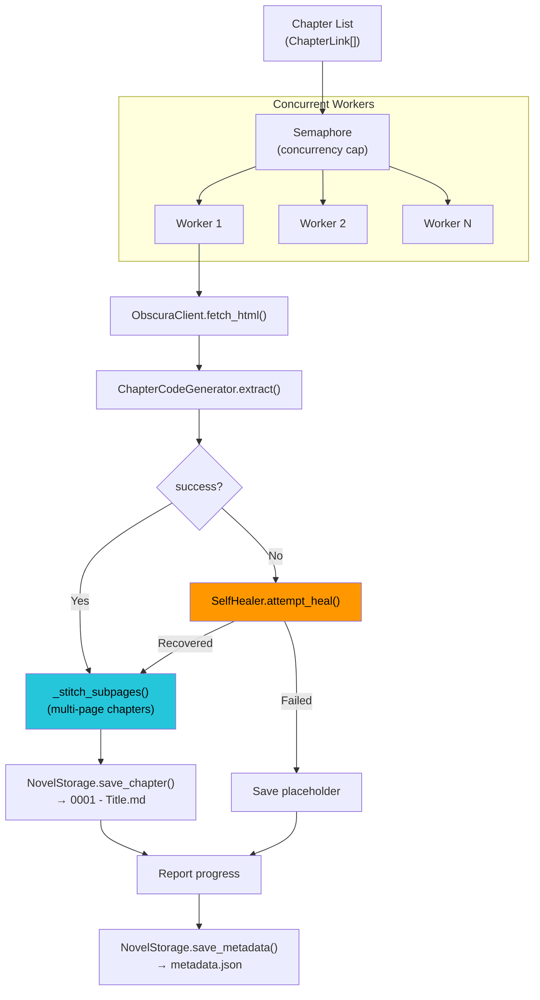

### Key Features

| Feature | Description |
|---------|-------------|
| **Polite Jitter** | Random delay between `MIN_DELAY` and `MAX_DELAY` per request |
| **HTTP 429 Backoff** | Exponential backoff on rate limit responses |
| **Self-Healing** | If extraction fails, `SelfHealer` re-analyzes DOM + Observer reviews |
| **Sub-page Stitching** | Detects `?page=2` / `下一页` links, fetches and concatenates content |
| **Pause/Resume/Cancel** | Supports user control via `asyncio.Event` |
| **Progress Tracking** | Reports chapters/minute speed to UI callback |

---

## 7. Self-Healing Engine

**File:** [self_healer.py](file:///D:/Code/Novel_scraping_agent/src/agent/self_healer.py)
**Class:** `SelfHealer`

Triggered during batch download when a chapter's HTML layout differs from the expected plan.

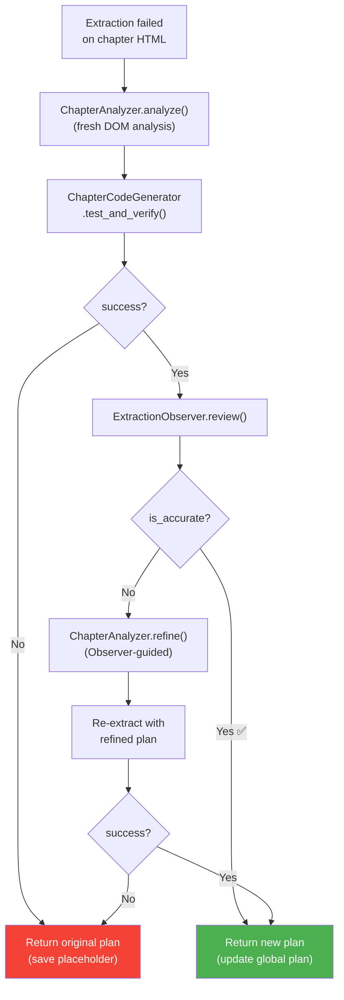

---

## 8. Domain Memory & Recipe System (0-Token Fast Path)

**File:** [domain_memory.py](file:///D:/Code/Novel_scraping_agent/src/agent/domain_memory.py)
**Class:** `DomainMemoryManager`

After successfully scraping a website for the first time, the system saves a **domain recipe** — both as structured JSON and as a standalone Python script. On subsequent scrapes from the same domain, the recipe enables **instant extraction with zero LLM calls**.

### 3-Stage Bypass Architecture

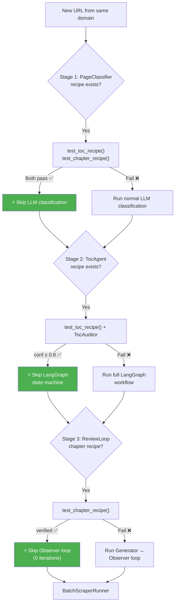

### Recipe File Structure

```
recipes/
├── freewebnovel.com.json    # Structured recipe metadata
└── freewebnovel.com.py      # Standalone executable script
```

#### JSON Recipe (`DomainRecipe`)
```json
{
  "domain": "freewebnovel.com",
  "created_at": "2026-09-17T00:00:00+00:00",
  "updated_at": "2026-09-17T00:00:00+00:00",
  "sample_toc_url": "https://freewebnovel.com/the-novel/...",
  "sample_chapter_url": "https://freewebnovel.com/the-novel/chapter-1.html",
  "toc_config": {
    "strategy": "dom_heuristic",
    "link_selector": "a[href]",
    "container_selector": null
  },
  "chapter_config": {
    "title_selector": ".chapter-title",
    "content_selector": "#chapter-content",
    "remove_selectors": ["script", "style", ".ad", "nav"],
    "quality_score": 0.95
  },
  "times_used": 5,
  "last_used_at": "2026-09-17T08:00:00+00:00"
}
```

#### Python Script (Standalone CLI)
The generated `.py` file contains two functions:
- `extract_toc(html, base_url)` → returns `list[dict]` of chapters
- `extract_chapter(html)` → returns `dict` with title, content, word_count

Can be run independently: `python recipes/freewebnovel.com.py --toc <url>`

---

## 9. Infrastructure Layer

### ObscuraClient ([obscura_client.py](file:///D:/Code/Novel_scraping_agent/src/core/obscura_client.py))

The HTTP and browser fetching layer with a 3-tier strategy:

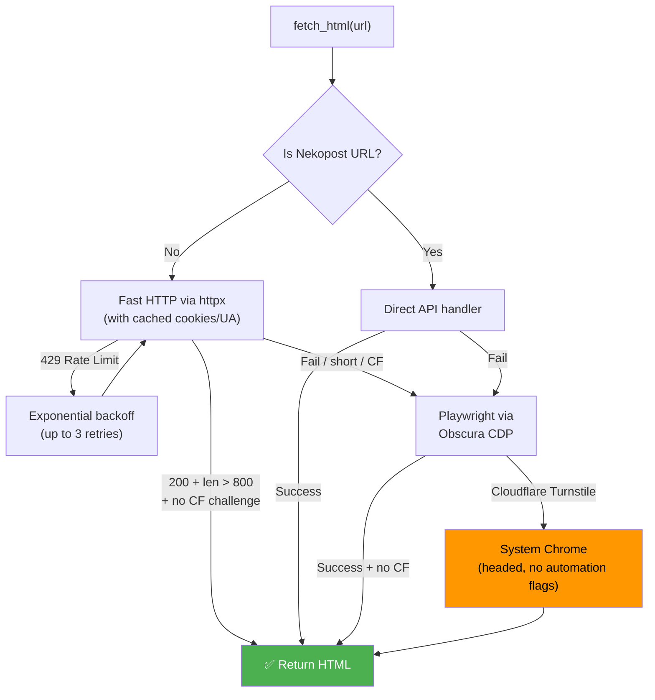

| Feature | Details |
|---------|---------|
| **Ad Blocking** | Routes matching `doubleclick|taboola|outbrain|...` are aborted |
| **CDP Connection** | Connects to Obscura via `ws://127.0.0.1:9222` WebSocket |
| **Cloudflare Bypass** | Falls back to headed system Chrome with anti-automation flags |
| **Cookie Caching** | Saves `cf_clearance` cookies for subsequent HTTP requests |

### LLMClient ([llm_client.py](file:///D:/Code/Novel_scraping_agent/src/agent/llm_client.py))

| Method | Purpose |
|--------|---------|
| `generate_json(prompt, schema)` | LangChain LCEL: `prompt \| chat_model \| PydanticOutputParser` |
| `generate_text(prompt)` | Raw text generation via Gemini |
| `get_chat_model(previous_id)` | Returns `ChatGeminiInteractions` with Interaction chaining |

Uses the **Gemini Interactions API** for multi-turn context persistence without resending full conversation history.

---

## 10. Entry Points

### CLI Headless Mode ([main.py](file:///D:/Code/Novel_scraping_agent/src/main.py))

```bash
python -m src.main --url "https://example.com/novel" --auto --concurrency 3
```

### Textual TUI ([app.py](file:///D:/Code/Novel_scraping_agent/src/ui/app.py))

```bash
python -m src.main --url "https://example.com/novel"
```

Both modes execute the same pipeline:
1. `ObscuraClient.fetch_html()` → Get page HTML
2. `PageClassifier.classify()` → Determine page type
3. `TocAgent.extract_toc()` → Extract all chapters
4. `NovelStorage.save_metadata()` → Create novel folder + initial metadata.json
5. `ReviewLoopOrchestrator.run()` → Determine extraction selectors
6. `domain_memory.save_recipe()` → Persist recipe for future use
7. `BatchScraperRunner.run()` → Download all chapters
8. `NovelStorage.save_metadata()` → Update final metadata.json

---

## 11. Output File Structure

```
novels/
└── The Harem System Rewards Me For Everything/
    ├── metadata.json          # Novel metadata + chapter index
    ├── 0001 - Chapter 1.md    # Chapter markdown files
    ├── 0002 - Chapter 2.md
    ├── ...
    └── 0027 - Chapter 27.md

recipes/
├── freewebnovel.com.json      # Saved domain recipe
└── freewebnovel.com.py        # Standalone Python scraper
```

---

## 12. Complete Data Flow Sequence Diagram

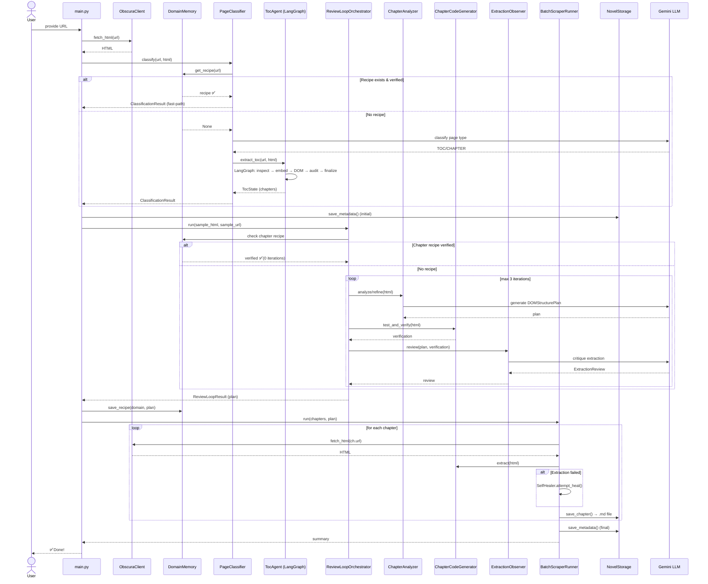

---

## 13. Technology Stack

| Layer | Technology |
|-------|-----------|
| **LLM** | Google Gemini (via Interactions API) |
| **LLM Framework** | LangChain LCEL (prompt \| model \| parser) |
| **State Machine** | LangGraph (`StateGraph`) |
| **Browser Automation** | Playwright + Obscura (Chromium CDP) |
| **HTTP Client** | httpx (async) |
| **HTML Parsing** | BeautifulSoup4 + lxml |
| **Data Models** | Pydantic v2 |
| **TUI** | Textual (Rich-based) |
| **CLI** | argparse + Rich Console |
| **Async Runtime** | asyncio |
| **File I/O** | aiofiles |
| **Testing** | pytest + pytest-asyncio |
