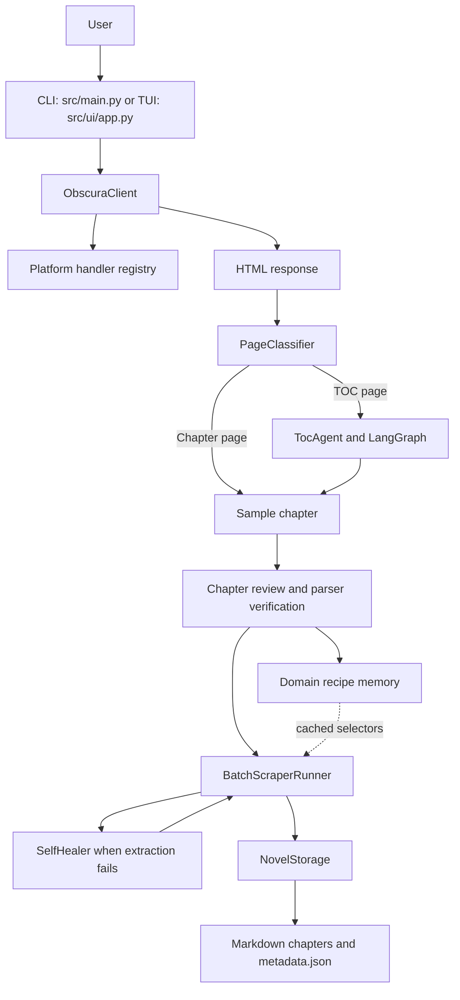

# Architecture and Project Structure

This guide describes the repository as it is currently organized. The source tree is authoritative; generated output, local environments, and caches are intentionally omitted from the tree below.

## System overview

The application accepts a novel URL through either the headless CLI or the Textual interface. Both entrypoints use the same browser, classification, extraction, and storage subsystems.



A known-domain recipe is a validated optimization, not an unconditional shortcut: TOC and chapter recipe results are tested against the current page before they are reused. If the recipe does not validate, the normal extraction or review path remains available.

## Repository layout

```text
Novel_scraping_agent/
├── bin/                         # Obscura binary location
├── docs/                        # Architecture and workflow guides
├── logs/                        # Runtime session logs
├── novels/                      # Downloaded novels and metadata
├── recipes/                     # Per-domain JSON recipes and generated Python extractors
├── scratch/                     # Local scratch workspace
├── scripts/
│   └── repair_scraped_novels.py  # Repair utility for existing scraped output
├── src/
│   ├── __init__.py
│   ├── config.py                # Environment-backed settings and runtime paths
│   ├── main.py                  # CLI entrypoint and headless pipeline
│   ├── agent/                   # Classification, extraction agents, memory, and LLM support
│   │   ├── __init__.py          # Public convenience exports
│   │   ├── analyzer.py          # Compatibility re-export for agent.ch.analyzer
│   │   ├── classifier.py        # TOC/chapter classification and page metadata
│   │   ├── code_generator.py    # Compatibility re-export for agent.ch.code_generator
│   │   ├── domain_memory.py     # DomainRecipe models and recipe persistence
│   │   ├── interactions_model.py # Compatibility re-export for agent.llm.interactions
│   │   ├── llm_client.py        # Compatibility re-export for agent.llm.client
│   │   ├── observer.py          # Compatibility re-export for agent.ch.observer
│   │   ├── review_loop.py       # Compatibility re-export for agent.ch.review_loop
│   │   ├── self_healer.py       # Compatibility re-export for agent.ch.self_healer
│   │   ├── token_tracker.py     # Compatibility re-export for agent.llm.tracker
│   │   ├── ch/                  # Chapter-page analysis and extraction
│   │   │   ├── __init__.py      # Chapter subsystem public exports
│   │   │   ├── analyzer.py      # DOMStructurePlan and ChapterAnalyzer
│   │   │   ├── code_generator.py # Deterministic parser generation and verification
│   │   │   ├── observer.py      # ExtractionReview quality assessment
│   │   │   ├── review_loop.py   # Analyze, verify, review, and refine coordination
│   │   │   └── self_healer.py   # Runtime repair after extraction failure
│   │   ├── llm/                 # Gemini / LangChain integration and token metrics
│   │   │   ├── __init__.py      # LLM and token-tracking exports
│   │   │   ├── client.py        # LLMClient and ChatGeminiInteractions model
│   │   │   ├── interactions.py  # Interactions API model integration
│   │   │   └── tracker.py       # Token records, tracker, and callback handler
│   │   └── toc/                 # Table-of-contents extraction workflow
│   │       ├── __init__.py
│   │       ├── agent.py         # TocAgent facade and recipe integration
│   │       ├── graph.py         # LangGraph state machine and routing
│   │       ├── state.py         # TocState schema
│   │       └── tools.py         # Metadata, embedded-state, DOM, audit, and crawl tools
│   ├── core/                    # Browser and low-level runtime infrastructure
│   │   ├── __init__.py          # Browser and binary-manager exports
│   │   ├── binary_manager.py    # Obscura discovery, download, and verification
│   │   ├── obscura_client.py    # HTTP/browser fetching and handler dispatch
│   │   ├── dekd_handler.py      # Compatibility re-export for handlers.dekd
│   │   ├── nekopost_handler.py  # Compatibility re-export for handlers.nekopost
│   │   └── webnovel_handler.py  # Compatibility re-export for handlers.webnovel
│   ├── handlers/                # Actual site-specific platform implementations
│   │   ├── __init__.py          # Handler exports and default registrations
│   │   ├── base.py              # BasePlatformHandler interface
│   │   ├── registry.py          # URL-based handler registry
│   │   ├── dekd.py              # Dek-D API and synthetic HTML handling
│   │   ├── nekopost.py          # Nekopost API, decryption, and chapter handling
│   │   └── webnovel.py          # WebNovel catalog and metadata handling
│   ├── scraper/                 # Batch execution and file persistence
│   │   ├── __init__.py          # Batch runner and storage exports
│   │   ├── batch_runner.py      # Concurrent fetch, extraction, healing, and pagination stitching
│   │   └── storage.py           # Chapter Markdown and novel metadata output
│   ├── ui/                      # Textual terminal application
│   │   ├── __init__.py          # Application export
│   │   ├── app.py               # Main UI and orchestration callbacks
│   │   └── widgets/
│   │       ├── __init__.py
│   │       ├── progress.py      # Batch progress and throughput display
│   │       └── reader.py        # Scrollable Markdown chapter preview
│   └── utils/                   # Shared utility functions
│       ├── __init__.py          # Common utility exports
│       ├── logger.py            # Session logging and markup cleanup
│       ├── romanizer.py         # Output-folder name romanization
│       └── title_cleaner.py     # Chapter title/content cleanup and order correction
├── tests/                       # Unit, integration, site-specific, and TUI tests
├── .env.example                 # Environment configuration template
├── AGENTS.md                    # Repository architecture and contributor guidance
├── CHANGELOG.md
├── README.md
├── pyproject.toml               # Package metadata, dependencies, and CLI entrypoint
└── uv.lock                      # Locked dependency versions
```

`bin/`, `logs/`, `novels/`, and `recipes/` are runtime data directories. `dist/`, `.venv/`, Python bytecode, and test caches are generated artifacts rather than source modules. Keep machine-specific secrets in a local `.env`; do not commit them.

## Source package responsibilities

### Entrypoints and configuration

- [`src/main.py`](../src/main.py) defines the `novel-scraper` CLI. `--auto --url ...` runs the headless pipeline; without `--auto`, it launches `NovelScraperApp`.
- [`src/config.py`](../src/config.py) loads `.env` values and defines paths and defaults for the browser, Gemini, logging, output, recipes, concurrency, delays, and review quality.
- [`pyproject.toml`](../pyproject.toml) declares Python `>=3.10`, dependencies, the `novel-scraper` console script, and the optional development test dependencies.

### Agent subsystem (`src/agent/`)

- **Classification — `classifier.py`:** `PageClassifier` returns a `ClassificationResult` and uses a saved domain recipe when it validates. Otherwise it calls the configured LLM or falls back to deterministic page heuristics. TOC results are passed through the TOC agent for extraction/audit.
- **TOC extraction — `toc/`:** `TocAgent` wraps the compiled LangGraph workflow. `TocState` carries the current page, extracted `ChapterLink` items, metadata, strategy, confidence/audit signals, pagination, healing state, and logs. `tools.py` contains `ClaimInspector`, `EmbeddedStateExtractor`, `DomLinkExtractor`, `InteractiveDomExpander`, `PaginatedTocCrawler`, `TocAuditor`, and `TocSynthesizer`.
- **Chapter extraction — `ch/`:** `ChapterAnalyzer` produces a `DOMStructurePlan`; `ChapterCodeGenerator` generates and tests a deterministic BeautifulSoup parser; `ExtractionObserver` returns a structured quality review; `ReviewLoopOrchestrator` coordinates refinement; and `SelfHealer` attempts repair when batch extraction fails.
- **LLM integration — `llm/`:** `LLMClient` provides the shared model interface, `ChatGeminiInteractions` integrates the Gemini Interactions API with LangChain, and `tracker.py` records token usage.
- **Domain memory — `domain_memory.py`:** stores validated TOC and chapter plans as `recipes/<domain>.json` and generated extractor code as `recipes/<domain>.py`. Consumers validate a saved plan against the current HTML before using it.
- **Compatibility exports:** root-level modules such as `agent/analyzer.py` and `agent/llm_client.py` re-export implementations from the `ch/` and `llm/` packages. Keep these shims when moving public symbols so existing imports continue to work.

### Browser and platform integration

- **`src/core/obscura_client.py`:** `ObscuraClient.fetch_html()` first checks the registered platform handlers, then attempts direct HTTP retrieval, and uses the Obscura/Playwright browser path when needed. The client also owns browser lifecycle and page access used by interactive TOC expansion.
- **`src/core/binary_manager.py`:** locates or provisions the Obscura executable.
- **`src/handlers/`:** contains the active `BasePlatformHandler` contract, registry, and Dek-D, Nekopost, and WebNovel implementations. A handler may return synthetic HTML from a platform API; returning no result lets the browser fetch continue. The similarly named modules under `src/core/` are compatibility re-exports, not the canonical implementations.

### Scraping, UI, and utilities

- **`src/scraper/batch_runner.py`:** runs chapter tasks under a bounded concurrency semaphore, applies configured request delays, extracts with the current plan, invokes self-healing on failed extraction, stitches supported multi-page chapters, reports progress, and updates metadata.
- **`src/scraper/storage.py`:** creates romanized/sanitized novel directories, writes chapter Markdown, and maintains `metadata.json`.
- **`src/ui/app.py`:** composes the Textual application and coordinates classification, preview, review, and batch actions. `ui/widgets/reader.py` renders Markdown; `ui/widgets/progress.py` reports batch status.
- **`src/utils/title_cleaner.py`:** cleans titles/content and can normalize reverse-ordered chapter lists. `romanizer.py` prepares folder names. `logger.py` provides persistent plain-text session logs and a Textual log bridge.

## Runtime flow

1. **Start and fetch.** The CLI or TUI creates the browser client. `ObscuraClient` dispatches matching platform handlers before its regular HTTP/browser retrieval path.
2. **Classify.** `PageClassifier` checks whether a saved TOC or chapter recipe matches the page. If not, it uses Gemini when available and deterministic heuristics as a fallback.
3. **Resolve the table of contents.** When a TOC is identified, `TocAgent` checks the stored TOC recipe and otherwise runs its LangGraph workflow:
   - inspect title, author, claimed chapter count, and pagination;
   - inspect embedded state such as Apollo data and JSON-LD;
   - extract DOM links if embedded data is insufficient;
   - audit completeness and route to pagination crawling, interactive expansion, selector synthesis, or finalization as appropriate;
   - de-duplicate links, repair ordering, clean titles, and assign sequential indices.
4. **Build a chapter parser.** The first chapter is analyzed as a sample. The review loop first validates a saved chapter plan; on a cache miss it analyzes the DOM, generates and tests a parser, and asks the observer to assess the result. It refines until approved or the configured iteration limit is reached, while retaining the best result.
5. **Remember the plan.** The validated TOC strategy and chapter plan can be stored in the domain recipe files for reuse. The generated Python extractor is an artifact of the recipe system; the application still validates recipe results before relying on them.
6. **Download and persist.** `BatchScraperRunner` fetches chapters concurrently, extracts content, attempts self-healing after extraction failures, follows supported next-page links within a chapter, and saves Markdown and updated metadata through `NovelStorage`.

The TOC graph and chapter review loop are independent mechanisms: TOC completeness is audited against available page signals, while chapter quality is assessed against the extracted sample. A successful result from one does not imply that the other has passed.

## Runtime data and output

- `recipes/<domain>.json` stores domain-level selectors, strategy, sample URLs, quality information, and usage timestamps; `recipes/<domain>.py` stores generated extraction code.
- `novels/<Romanized_Title>/` contains zero-padded chapter Markdown files and `metadata.json`.
- `logs/` contains timestamped CLI/TUI logs and a latest-session log.
- `bin/` is the configured Obscura binary location. The executable can also be selected with `OBSCURA_BIN_PATH`.

## Tests and extension points

Run the full suite from the repository root with:

```bash
uv run pytest
```

Tests are grouped by agent behavior, domain memory, browser/platform handling, site-specific extraction, persistence/utilities, and the TUI. Network and model behavior should be mocked in unit tests where practical.

When adding code, keep TOC enumeration in `src/agent/toc/`, chapter analysis and quality review in `src/agent/ch/`, model and token integrations in `src/agent/llm/`, platform-specific bypasses in `src/handlers/`, browser lifecycle in `src/core/`, and batch/storage behavior in `src/scraper/`. Add or update tests alongside the implementation and preserve compatibility re-exports when changing public import paths.
